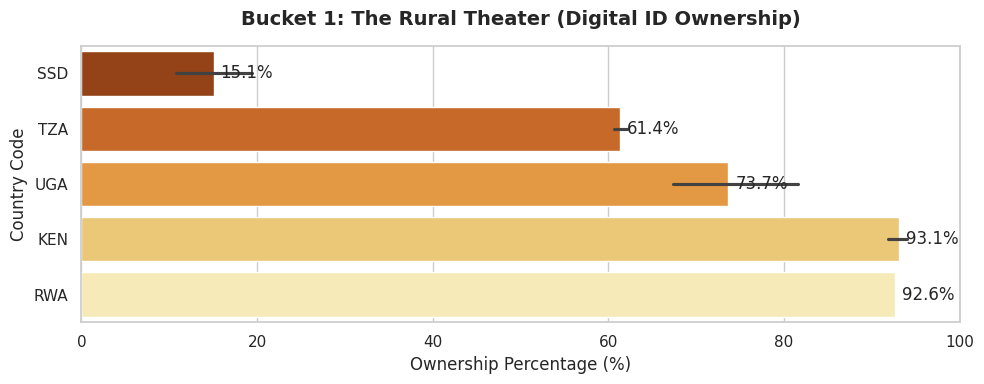
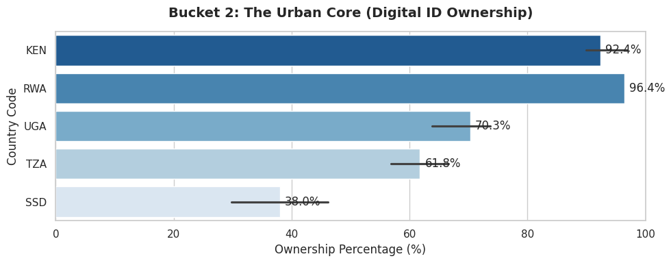
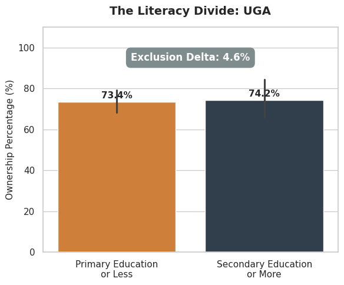

# GovTech Zero-Trust Security Matrix
**An Operational Cybersecurity Framework for Scaling Digital Public Infrastructure (DPI)**

## Executive Summary
Developing nations are rapidly scaling interconnected Digital Public Ecosystems (DPE) to facilitate e-government services and health surveillance. However, projects such as the World Bank UDAP-GovNet initiativebeing ran in conjuction with the National Information Technology Authority - Uganda face implementation roadblocks due to cross-agency data integration risks and strict national privacy laws, such as the Uganda Data Protection and Privacy Act (DPA) 2019. 

This project is a mathematically verifiable audit matrix engineered to resolve these bottlenecks. It translates abstract legal mandates (e.g., "Privacy by Design", "Informed Consent") into cryptographic and architectural requirements, allowing client governments to launch interconnected e-services safely and accelerate project execution.

---

## Part 1: The Threat Landscape (EDA)
A flat security approach fails in dynamic environments. Analysis of ID4D global dataset metrics across the East African bloc reveals three distinct operational threat theaters requiring specific engineering countermeasures.

### 1. The Rural Theater (Infrastructure Voids)
Deploying ID systems in highly rural, off-grid environments presents severe hardware and connectivity risks. Closing the rural ownership gap requires offline mobile biometric capture, necessitating strict edge-node security protocols to prevent data breaches from stolen field equipment.

### 2. The Urban Core (Integration & Interoperability Risk)
In urban centers with >60% ID ownership, the challenge shifts from enrollment to interoperability. High adoption rates mean multiple ministries (Health, Finance, Agriculture) are actively querying central ID databases, exponentially expanding the attack surface.

### 3. The Literacy Divide (Sovereign Threat Profiles)
Lower education directly correlates with DPI exclusion. Scaling ID systems across low-literacy demographics legally demands non-text-based, cryptographically verifiable consent flows to comply with Section 13 of the DPA 2019.
 *(Note: Substitute image link based on target sovereign state)*

---

## Part 2: The Security Architecture & Codebase
This repository contains the functional Python prototypes demonstrating the core cryptographic solutions to the threats identified above.

### Module 1: Edge-Node Security (`/module1_edge_security`)
*Addresses off-grid enrollment vulnerabilities and DPA Section 20 (Security of Data).*
* **Zero-Knowledge Offline Storage:** Biometric templates captured offline are encrypted at rest using AES-256-GCM. The symmetric key is wrapped by an RSA-2048 public key. The edge device can write data, but only the central sovereign server holds the private key to read it.

### Module 2: Cryptographic Consent Validation (`/module2_consent_validation`)
*Addresses the literacy exclusion gap and DPA Section 13 (Informed Consent).*
* **Immutable Hash Ledgers:** Replaces text-based waivers with audio/video affirmative nodes. The audio file is hashed (SHA-256) and cryptographically bound directly to the user's biometric payload, creating a mathematically verifiable ledger of consent.

### Module 3: Zero-Trust API Gateway (`/module3_zero_trust_api`)
*Addresses cross-agency integration friction and DPA Section 19 (Cross-System Processing).*
* **Tokenized Data Minimization:** Enforces mutually authenticated TLS (mTLS) 1.3 and automated rate-throttling. Endpoints return strict Boolean tokens (Yes/No verifications) rather than transmitting full JSON demographic profiles, neutralizing lateral scraping attacks.

---
*Marco*
